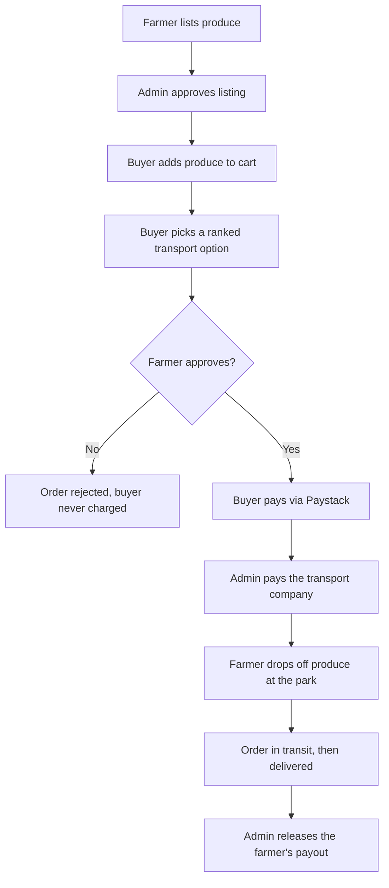

# 🌾 AgroReach

**A smart agricultural distribution and market access system that connects smallholder farmers in Kaduna State directly with buyers across Nigeria.**


---

## About

Smallholder farmers (1–10 plots) often depend on middlemen to sell their produce and have no easy way to arrange transport to distant buyers. AgroReach lets farmers list produce online, lets buyers anywhere in Nigeria's 36 states and the FCT order it, and uses a **Logistics Recommendation Engine** to rank transport companies for each delivery by price.

Farmers stay in control: **no buyer is charged until the farmer approves the order.**

## How it works



## Features

| Farmer | Buyer | Admin |
|---|---|---|
| List produce with photos | Browse and search approved produce | Approve or reject listings |
| Approve or reject order requests | Cart with live stock checks | Logistics dashboard for every order |
| See payout amount and ETA | Compare ranked transport options | Confirm payment to transport companies |
| Request payout with saved bank details | Pay only after farmer approval | Release farmer payouts |
| Message buyers | Track orders, rate and review | Manage users |

Also included: in-app messaging, notifications, profile pages, and automatic **Sold Out** handling when two buyers request the same produce.

## The Logistics Recommendation Engine

For every farmer in a buyer's cart, the engine lists each transport company that serves the buyer's state and ranks them cheapest first:

```
price = company base fee + (road distance from Kaduna × ₦8/km) + (order quantity × ₦100)
```

The rule is transparent by design, so every price can be traced back to its three parts. The buyer's choice is final and is shown to the farmer for approval.

## Tech stack

- **Backend:** Node.js, Express
- **Database:** SQLite (better-sqlite3)
- **Views:** EJS, HTML, CSS, vanilla JavaScript
- **Auth:** express-session, bcrypt
- **Payments:** Paystack (test mode)
- **Uploads:** multer

## Getting started

**Requirements:** Node.js 18 or later and a free [Paystack](https://paystack.com) test account.

```bash
# 1. Clone the repository
git clone https://github.com/<your-username>/<your-repo>.git
cd <your-repo>

# 2. Install dependencies
npm install

# 3. Create your environment file, then add your Paystack test keys
cp .env.example .env

# 4. Create the first admin account (uses ADMIN_* values in .env)
npm run create-admin

# 5. Start the app
npm start
```

Open **http://localhost:3000**, register a farmer and a buyer, and log in as admin with the details from your `.env`.

## Project structure

```
src/
├── db/          # schema, seed transport companies, state distances
├── middleware/  # auth and photo upload
├── routes/      # farmer, buyer, admin, auth, messages, notifications
├── services/    # logistics pricing, stock management, order lifecycle, Paystack
├── views/       # EJS pages for each role
└── server.js
```

## Notes

- Payments run in **Paystack test mode**; no real money moves.
- Transport tracking and delivery are **simulated** (a tracking ID after 10 seconds, delivery after 2 minutes) because no courier API is connected.
- Farmer payouts are recorded by the admin, not sent as real bank transfers.
- Transport company prices and coverage are seeded estimates for demonstration.
